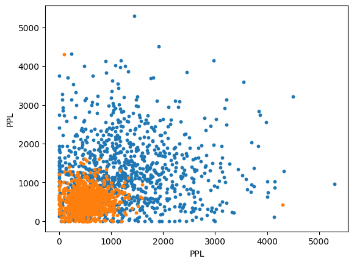
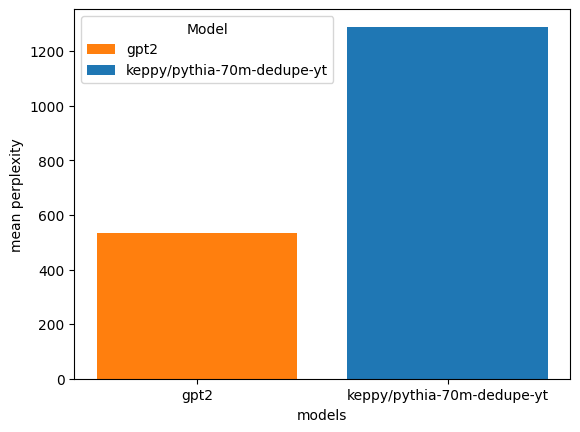

# Fine Tuning Pythia by Hand and Calculating PPL
6/24/2023

This is an introduction on how to get your feet wet writing a training loop to fine tune a GPT-NeoX model, specifically the 70m deduped Pythia model.
After fine tuning, I measure and compare the PPL to gpt2 and do some rough plots to contrast the two models.
The notebook can run on a free colab GPU instance so this is great for just a proof of concept that we can in fact fine tune the model on new data.

> Disclaimer: this model is not intended for production use

| Resource type | URI                                                           |
|---------------|---------------------------------------------------------------|
| Model         | https://huggingface.co/keppy/pythia-70m-dedupe-yt             |
| Notebook      | https://gist.github.com/keppy/a5be88ea59a67a901571b6e0c3478585|

## Fine Tuning
Some of the more interesting bits from the fine tuning and metric calculations follow below.

This bit of code called `group_texts()` can be found at https://huggingface.co/docs/transformers/tasks/language_modeling:
```py
block_size = 128

def group_texts(examples):
    # Concatenate all texts.
    concatenated_examples = {k: sum(examples[k], []) for k in examples.keys()}
    total_length = len(concatenated_examples[list(examples.keys())[0]])
    # We drop the small remainder, we could add padding if the model supported it instead of this drop, you can
    # customize this part to your needs.
    if total_length >= block_size:
        total_length = (total_length // block_size) * block_size
    # Split by chunks of block_size.
    result = {
        k: [t[i : i + block_size] for i in range(0, total_length, block_size)]
        for k, t in concatenated_examples.items()
    }
    result["labels"] = result["input_ids"].copy()
    return result
     
```
We have to run our tokenized text examples through this function to turn them into blocks of text that we can train on. So you can't just tokenize the data and then use that in your training loop. This is obvious to me now but when I was new to the API I found it odd that you cart this function around copy paste style.

If we take a look at the actual training loop we see that we take our batches from the `train_dataloader` which was built using `group_texts()`:
```py
model.train()
for epoch in range(num_epochs):
    for batch in train_dataloader:
        batch = {k: v.to(device) for k, v in batch.items()}
        outputs = model(**batch)
        loss = outputs.loss
        loss.backward()

        optimizer.step()
        lr_scheduler.step()
        optimizer.zero_grad()
```

## Evaluation
By now we have done our transfer learning (I'm not that old I swear) and we have our model as the result. So how do we evaluate this causal model? We want to get the model's perplexity (PPL). I'll let you research more about what that means but basically there is a library from Hugging Face called evaluate which will let us compute PPL against models on the Hugging Face hub.

What we do in the notebook is upload our newly trained model to the hub. Then, after doing a round of batching and evaluation, we can compute two separate metrics--one for gpt2 and one for our model to compare. We do this by adding batches of decoded tokens (predictions) to our metric evaluators inside the eval loop and then computing the metrics after the loop has finished.
 
```py
# batching, eval, using metric.add_batch()......
# ...
gpt2_PPL = gpt2_metric.compute(model_id="gpt2")
yt_PPL = yt_metric.compute(model_id="keppy/pythia-70m-dedupe-yt")
```
Notice how we just have to pass model IDs to compute. This allows us to compare the PPL of these two models and we can graph it.



The metric gives us also a mean perplexity so we can show that as some bars as well.



Feel free to copy the notebook from the gist to your own colab. Hopefully this is enough info to get you started. Going through the notebook will take you step by step, and it doesn't take long to run as I've used a very small subset of the dataset.

